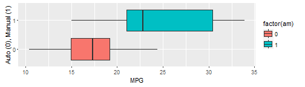
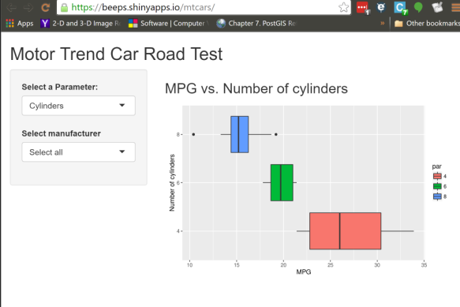

## Motor Trend Data
### Relation with MPG 

This report by Motor Trend magazine investigates the relationship between a vehicle parameters and fuel consumption per gallon(MPG). The dataset used here is from the 1974 MotorTrend US magazine. It compromises of 11 aspects of automobile design and performance for 32 automobiles(1973-74 models). We will investigate the factors like transmission, cylinders, displacement, horse power, weight, qsec, gear and number of carburetors that contribute to performance. Also investigate the effects of car manufacturers.

--- .class #id 

## Contents

### 1. Visualization App

A shiny App visualizes the individual effects of parameters like transmission type, number of gears, vehicle weight, displacement, number of cylinders, etc.. have on vechicle performance in MPG. The data is grouped and effects of manufacturers are also visible(the data is limited to 32 observations)

Link to app and source code
* [Shiny App](https://beeps.shinyapps.io/mtcars)
* [Source Code](https://github.com/beeps82/DataProducts/tree/master/mtCarsApp/mtcars)

### 2. Presentation

A Slidify presentation describing the application and usage of this app. (RPubs link)
* [Slidify Presentation](http://rpubs.com/beeps82/DevelopingDataProductsProject)


--- .class #id

## Motor Cars Trend Data


### Exploratory Data Analyses
There seem to be no missing values or nothing out of the ordinary in this dataset 


```
##                    mpg cyl disp  hp drat    wt  qsec vs am gear carb
## Mazda RX4         21.0   6  160 110 3.90 2.620 16.46  0  1    4    4
## Mazda RX4 Wag     21.0   6  160 110 3.90 2.875 17.02  0  1    4    4
## Datsun 710        22.8   4  108  93 3.85 2.320 18.61  1  1    4    1
## Hornet 4 Drive    21.4   6  258 110 3.08 3.215 19.44  1  0    3    1
## Hornet Sportabout 18.7   8  360 175 3.15 3.440 17.02  0  0    3    2
## Valiant           18.1   6  225 105 2.76 3.460 20.22  1  0    3    1
```



```

--- .class #id

## Usage

* Choose a vehicle parameter(transmission,gear,hp,..) to compare with MPG
* Select a vehicle make(select all by default)

 


